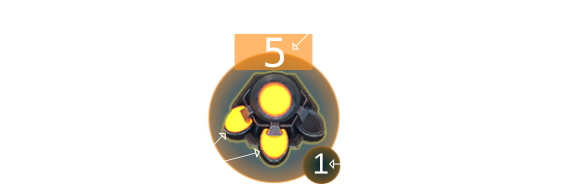
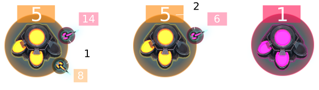

<h1>&nbsp; The Goal</h1>

<!-- LEAGUES wood3 wood2 wood1 bronze -->Your objective is to produce a maximum amount of <strong>cyborgs</strong> in order to destroy those of your opponent. To this end, you must take ownership of <strong>factories</strong> that will enable you to increase the size of your cyborg army.

<!-- RULES -->

<h1>&nbsp; Rules</h1>

The game is played with 2 players on a board on which a variable number of <strong>factories</strong> are placed (from <const>7</const> to <const>15</const> factories). Initially, each player holds a single factory in which there is a stock of <const>15</const> to <const>30</const> cyborgs. The other factories are neutral but also have cyborgs defending them.

On each turn, a player can send any number of cyborgs from one factory to another. The cyborgs in transit form a <strong>troop</strong>. This <strong>troop</strong> will take between <const>1</const> and <const>20</const> turns to reach its destination. When the <strong>troop</strong> arrives, the cyborgs will fight with any opponent cyborgs present at the factory.

<strong>Factory placement</strong> 
 
Factories are placed randomly across the map at the start of each game. The player is given the distance between each factory, expressed as the number of turns it takes to reach a factory starting from another.

<strong>Game Turn</strong> 
 
One game turn is computed as follows:

<ul>
	<li>Move existing troops and bombs</li>
	<li>Execute user orders</li>
	<li>Produce new cyborgs in all factories</li>
	<li>Solve battles</li>
	<li>Make the bombs explode</li>
	<li>Check end conditions</li>
</ul>

&nbsp;

<strong>Cyborg Production</strong> 
 
Each turn, every non-neutral factory produces between <const>0</const> and <const>3</const> cyborgs.

&nbsp;

<strong>Battles</strong> 
 
To conquer a factory, you must send cyborgs to the coveted factory. Battles are played in this order:

<ol>
	<li>Cyborgs that reach the same destination on the same turn fight between themselves.</li>
	<li>Remaining cyborgs fight against the ones already present in the factory (beware that the cyborgs currently leaving do not fight).</li>
</ol>
If the number of attacking cyborgs is greater than the number of cyborgs in defense, the factory will then belong to the attacking player and it will start producing new cyborgs for this player on the next turn.

&nbsp;

<strong>Bombs</strong> 
 
Each player possesses <const>2</const> <strong>bombs</strong> for each game. A bomb can be sent from any factory you control to any factory. The corresponding action is: <action>BOMB</action> <var>source</var> <var>destination</var>, where <var>source</var> is the identifier of the source factory, and <var>destination</var> is the identifier of the destination factory. 
 
When a bomb reaches a factory, half of the cyborgs in the factory are destroyed (floored), for a minimum of 10 destroyed cyborgs. For example, if there are 33 cyborgs, 16 will be destroyed. But if there are only 13 cyborgs, 10 will be destroyed. 
 
<strong>Following a bomb explosion, the factory won't be able to produce any new cyborgs during <const>5</const> turns.</strong> 
 
Be careful, your radar is able to detect the launch of a bomb but you don't know where its target is! 
 
It is impossible to send a bomb and a troop at the same time from the same factory and to the same destination. If you try to do so, only the bomb will be sent.

<strong>Production Increase</strong> 
 
At any moment, you can decide to sacrifice 10 cyborgs in a factory to indefinitely increase its production by one cyborg per turn. A factory will not be able to produce more than <const>3</const> cyborgs per turn. The corresponding action is: <action>INC</action> <var>factory</var>, where <var>factory</var> is the identifier of the factory that you want to improve.

<!-- Victory conditions -->

&nbsp;

Victory Conditions

<ul>
	<li>Your opponent has no cyborgs left, nor any factories capable of producing new cyborgs.</li>
	<li>You have more cyborgs than your opponent after 200 turns.</li>
</ul>

<!-- EXPERT RULES -->

<h1>&nbsp; Expert Rules</h1>

Because a source code is worth a thousand words, you can access to the code of the "Referee" on <a href="https://github.com/CodinGame/ghost-in-the-cell/blob/master/Referee.java" target="_blank">our GitHub</a>.

<!-- PROTOCOL -->

<h1>&nbsp; Game Input</h1>
<!-- Protocol block -->

Initialization input

Line 1:<var>factoryCount</var>, the number of factories. 
Line 2:<var>linkCount</var>, the number of links between factories. 
Next <var>linkCount</var> lines: 3 space-separated integers <var>factory1</var>, <var>factory2</var> and <var>distance</var>, where <var>distance</var> is the number of turns needed for a troop to travel between <var>factory1</var> and <var>factory2</var>.

<!-- Protocol block -->

Input for one game turn

Line 1: an integer <var>entityCount</var>, the number of entities. 
Next <var>entityCount</var> lines: an integer <var>entityId</var>, a string <var>entityType</var> and 5 integers <var>arg1</var>, <var>arg2</var>, <var>arg3</var>, <var>arg4</var> and <var>arg5</var>. 
 
If <var>entityType</var> equals <const>FACTORY</const> then the arguments are:

<ul>
	<li><var>arg1</var>: player that owns the factory: <const>1</const> for you, <const>-1</const> for your opponent and <const>0</const> if neutral</li>
	<li><var>arg2</var>: number of cyborgs in the factory</li>
	<li><var>arg3</var>: factory production (between 0 and 3)</li>
	<li><var>arg4</var>: number of turns before the factory starts producing again (0 means that the factory produces normally)</li>
	<li><var>arg5</var>: unused</li>
</ul>
If <var>entityType</var> equals <const>TROOP</const> then the arguments are:

<ul>
	<li><var>arg1</var>: player that owns the troop: <const>1</const> for you or <const>-1</const> for your opponent</li>
	<li><var>arg2</var>: identifier of the factory from where the troop leaves</li>
	<li><var>arg3</var>: identifier of the factory targeted by the troop</li>
	<li><var>arg4</var>: number of cyborgs in the troop (positive integer)</li>
	<li><var>arg5</var>: remaining number of turns before the troop arrives (positive integer)</li>
</ul>
If <var>entityType</var> equals <const>BOMB</const> then the arguments are:

<ul>
	<li><var>arg1</var>: player that send the bomb: <const>1</const> if it is you, <const>-1</const> if it is your opponent</li>
	<li><var>arg2</var>: identifier of the factory from where the bomb is launched</li>
	<li><var>arg3</var>: identifier of the targeted factory if it's your bomb, <const>-1</const> otherwise</li>
	<li><var>arg4</var>: remaining number of turns before the bomb explodes (positive integer) if that's your bomb, <const>-1</const> otherwise</li>
	<li><var>arg5</var>: unused</li>
</ul>

<!-- Protocol block -->

Output for one game turn

The available actions are:
<ul>
	<li><action>MOVE</action> <var>source</var> <var>destination</var> <var>cyborgCount</var>: creates a troop of <var>cyborgCount</var> cyborgs at the factory <var>source</var> and sends that troop towards <var>destination</var>. Example: <action>MOVE 2 4 12</action> will send 12 cyborgs from factory 2 to factory 4.</li>
	<li><action>BOMB</action> <var>source</var> <var>destination</var>: creates a bomb in the factory <var>source</var> and sends it towards <var>destination</var>.</li>
	<li><action>INC</action> <var>factory</var>: increases the production of the factory <var>factory</var> at the cost of <const>10</const> cyborgs.</li>
	<li><action>WAIT</action>: does nothing.</li>
	<li><action>MSG</action> <var>message</var>: prints a message on the screen.</li>
</ul>
You may use several actions by using a semi-colon <action>;</action>. Example: <action>MOVE 1 3 18</action> <action>;</action> <action>MSG Attack Factory 3</action>. If you try to move more cyborgs that there are in the source factory, then all the available units will be sent.

<!-- Protocol block -->

Constraints

<const>7</const> ≤ <var>factoryCount</var> ≤ <const>15</const> 
<const>21</const> ≤ <var>linkCount</var> ≤ <const>105</const> 
<const>1</const> ≤ <var>distance</var> ≤ <const>20</const> 
Response time for first turn ≤ 1000ms 
Response time for one turn ≤ 50ms

</cg-statement>
					

				
